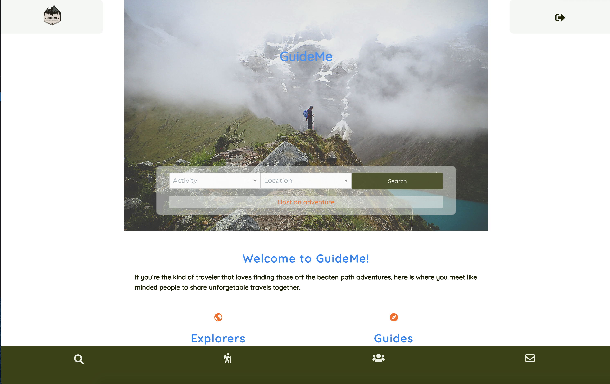
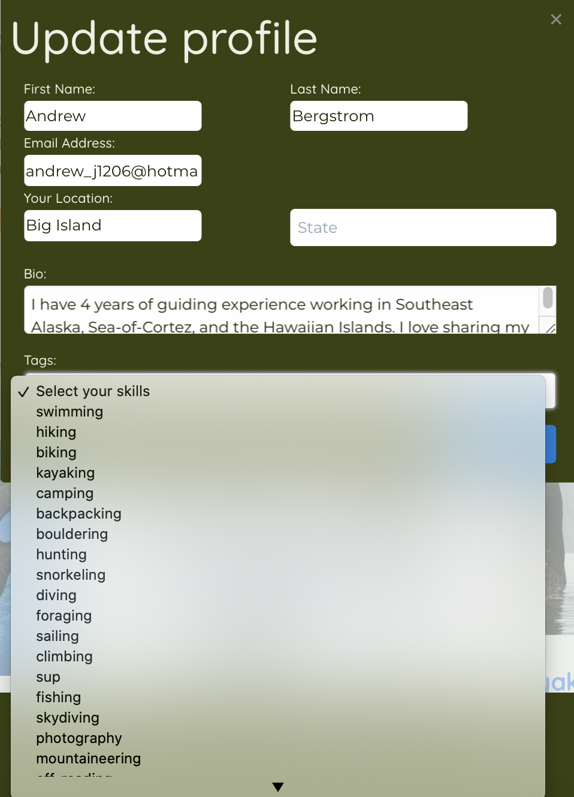
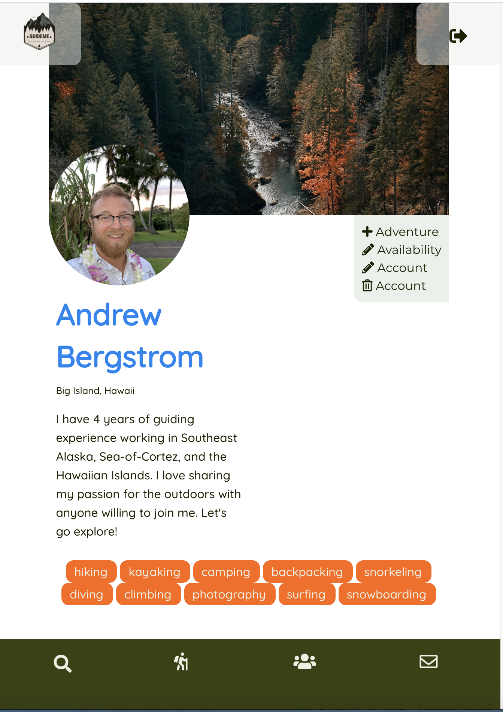
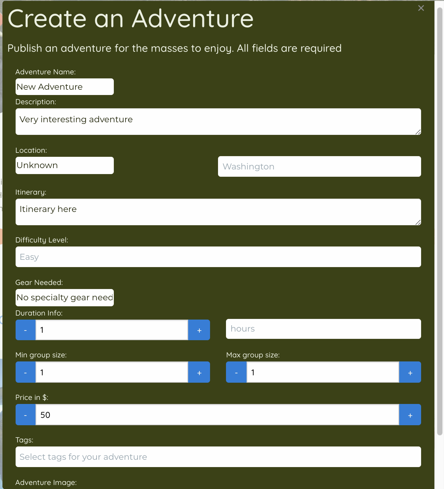
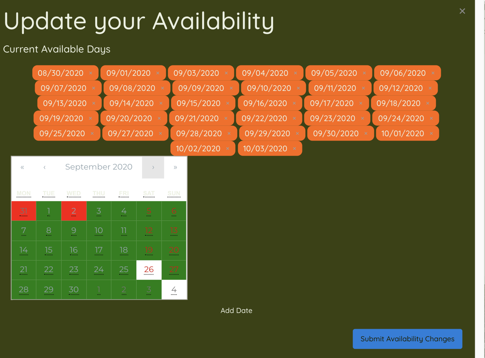
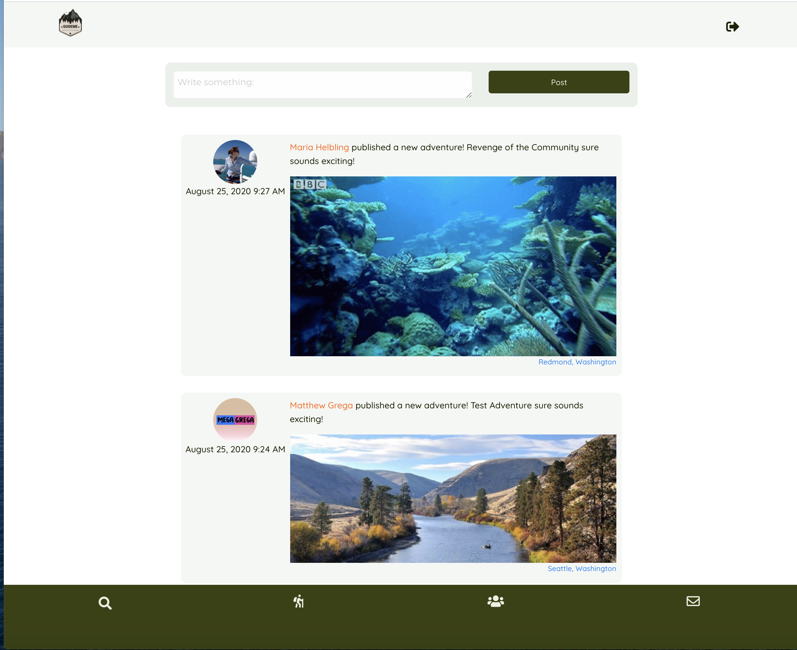

  # GuideMe
### Deployed link: https://guidemedimma.herokuapp.com/
  ## Project Creators: 
  ### Dominic, Matt, Maria, Indy, Andrew
---
  
  ## Project Description:
  ### GuideMe redefines traveling as we know it. Our goal was to create a streamlined service that connects modern day travelers with guides who can provide unique experiences. 

  
---
 
  ## Table of Contents
  1. [Installation](#Installation)
  2. [Usage](#Usage)
  3. [Contributing](#Contributing)
  4. [Links](#Links)
  5. [Email](#Contact)
  
  ---

  ## Installation:
  ## Developers please see the package.json file and then run NPM install on your command line.

  ---      

  ## Usage:

  * Starting on the home page anyone can search for an activity using the dropdown. Alternatively anyone can  choose a state and search for any adventure in that state. 
    * After running the search from the main page you will be taken to the adventures page, and you will see adventures populate below. Each adventure is a flipcard so by clicking one, you will find more details on the back side of the card. 
    * If you would like to book that adventure simply click the log in to book adventure. From there you will be redirected to log in or create an account.
  * Now that you're logged in you have a few options 
    * You can edit your account, click on your profile picture or banner/background picture to change it.
    * You  can edit your account: add your location, a little bio and be sure to include some of your interests (tags). 
    

  * Once logged in,you can return to the adventure page and book an activity. 

  * If you are a guide, on your profile page you will see a button that says 'become a guide'. By selecting that your profile page display a new button that says '+ adventure'. Click that to create an adventure you would like to take people on. 

  

  

* Now that you have updated your profile, and added an adventure it's time to set your availability. Simply click the edit availability button on profile page and make your own schedule. 

  

* Your account is set up! Head on over to the community page and see what the new happenings are. 

  
  ---
 
 ## Contributing:
 ## Please contact anyone from the Dev Team.
---

 ## Links

  * linkedIn: 
    * Andrew Bergstrom: https://www.linkedin.com/in/andrew-bergstrom-74a79aa4/ 
    * Maria Helbling: https://www.linkedin.com/in/mariahelblingprofile/
    * Matthew Grega: https://www.linkedin.com/in/matthew-grega-2047221b1/
    * Indy Minhas: https://www.linkedin.com/in/inderjit-minhas-021879141/
    * Dominic Parker:  https://www.linkedin.com/in/dominic-j-parker/

        
  * Github:
    * GuideMe: https://github.com/domjparker/GuideMe-FE
    * Andrew Bergstrom: https://github.com/AndrewBergstrom 
    * Maria Helbling:https://github.com/maria-helbling
    * Matthew Grega:https://github.com/MegaGrega
    * Indy Minhas: https://github.com/indyminhas
    * Dominic Parker: https://github.com/domjparker

  ---

  ## Contact
 
  ## If you have any questions, contact the author directly at: 
  ### Andrew.Bergstrom88@gmail.com 
  ### dominic.j.parker@gmail.com
  ### mkmgrega@gmail.com
  ### iminhas@live.com
  ### mariahelbling1000@gmail.com

---
### 
  [Back to the top](#GuideMe)
### or check out the app: https://guidemedimma.herokuapp.com/
  
  

